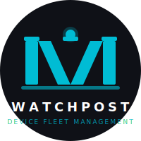

<p align="center">
  
</p>

<h1 align="center">Watchpost</h1>
<p align="center"><strong>Device Fleet Management</strong></p>
<p align="center"><em>Always watching. Always compliant.</em></p>

<p align="center">
  
  
  
  
  
  
</p>

---

## Overview

Watchpost is a self-hosted, open-source **Android Mobile Device Management (MDM)** and
**Firmware-Over-The-Air (FOTA)** platform built for enterprise fleets. It gives IT and
security teams a single control plane to enroll, monitor, and enforce policy on managed
Android devices — no third-party cloud required, no per-device licensing fees.

The UX philosophy is inspired by [FleetDM](https://fleetdm.com/) — policy-as-code,
query-driven telemetry, label-based device grouping. On-device enforcement is built
directly on the Android [`DevicePolicyManager`](https://developer.android.com/reference/android/app/admin/DevicePolicyManager)
APIs (Device Owner mode), the same foundation used by enterprise MDMs like Samsung Knox
and Google's [Android Enterprise](https://developers.google.com/android/work).

> Watchpost draws from the design philosophy of [FleetDM](https://fleetdm.com/) for its
> fleet-as-code UX and builds on the [Android Device Policy Controller](https://developer.android.com/work/dpc/build-dpc)
> APIs — the same layer that powers the [OpenMDM](https://openmdm.io/) ecosystem.

---
## Architecture

```
┌──────────────────────────────────────────────────┐
│           Watchpost Console  (React SPA)         │
│  Dashboard · Devices · Policies · Queries        │
│  Teams · Labels · Reports · Webhooks · Audit     │
└────────────────────┬─────────────────────────────┘
                     │  REST  /  JWT  over HTTPS
┌────────────────────▼─────────────────────────────┐
│           Watchpost API  (Go 1.22+)              │
│  Auth · RBAC · Policy Engine · Audit Log         │
│  FCM v1 Push · Webhook Dispatcher · Reports      │
└───────┬──────────────────────────┬───────────────┘
        │                          │
┌───────▼──────────┐   ┌───────────▼──────────────┐
│  PostgreSQL 15   │   │  Redis  ·  MinIO (S3)     │
│  Primary store   │   │  Job queue · APK storage  │
└──────────────────┘   └──────────────────────────┘
        │  FCM v1
┌───────▼──────────────────────────────────────────┐
│      Watchpost Agent  (Android / Kotlin)         │
│  Device Owner (DPC) · PolicyEvaluator            │
│  SyncWorker · AppInstaller · RootDetector        │
│  TelemetryCollector · QR Enrollment deep-link    │
└──────────────────────────────────────────────────┘
```

### Technology Stack

| Layer | Technology |
|---|---|
| Backend API | Go 1.22+, stdlib `net/http`, `lib/pq`, `golang-jwt/jwt` |
| Web Console | React 18, TypeScript, Tailwind CSS, Vite, Recharts |
| Android Agent | Kotlin, Android SDK 26+, WorkManager, Firebase Messaging |
| Database | PostgreSQL 15 |
| Cache / Queue | Redis 7 |
| Object Storage | MinIO (self-hosted S3-compatible) |
| Push | Firebase Cloud Messaging HTTP v1 (service-account OAuth2) |
| Containers | Docker + Docker Compose |

---
## Features

### Enrollment & Identity
- **QR-code enrollment** — Device Owner provisioning via camera scan; QR codes generated in the console and deep-linked into the Watchpost Agent app
- **Token-based enrollment** — Time-limited, max-use enrollment tokens managed from the console
- **Automatic token seeding** — Default enrollment token seeded from `DEFAULT_ENROLLMENT_TOKEN` env var on first start; no hardcoded credentials
- **FCM v1 push** — Firebase Cloud Messaging HTTP v1 API with service-account OAuth2 authentication (no legacy server key required)

### Policy Engine (Policy-as-Code)
- **YAML declarative policies** — Write policies as YAML, apply them to teams or globally
- **13 enforced policy types** on Android Device Owner:
  - Password complexity, minimum length, expiration, max failed attempts
  - Camera disable, screen timeout, keyguard feature restrictions
  - Encryption enforcement, microphone disable (API 31+)
  - USB file transfer block, Bluetooth disable (via `UserManager` restrictions)
  - Wi-Fi profile push (WPA2 via `WifiConfiguration`)
  - Always-on VPN (`setAlwaysOnVpnPackage`, API 24+)
  - App block-list (`setApplicationHidden`), kiosk packages (`setLockTaskPackages`)
  - CA certificate push (`installCaCert`)
- **Policy versioning** — Every save creates a snapshot in `policy_versions`; roll back to any prior version from the console
- **Compliance reporting** — Devices report per-policy compliance status on every sync

### Device Management
- **Real-time telemetry** — Battery level, storage (total/available), Wi-Fi SSID, installed app inventory, OS version, security patch level
- **Remote commands** — Lock screen, Reboot, Corporate Wipe, Factory Reset — all delivered via FCM push with a command queue fallback
- **Corporate vs Full Wipe** — `WIPE_EXTERNAL_STORAGE` for managed-data-only wipe vs `wipeData(0)` for full factory reset
- **Root detection** — Agent checks `su` binary paths, Magisk package, test-keys build tags, and writable `/system` mount; reports `NON_COMPLIANT` compliance event automatically

### Fleet Organisation
- **Teams** — Static organisational groups; policies and app deployments scoped per team
- **Labels** — Dynamic rule-based device groups (`os_version LIKE 'Android 14%'`, etc.); auto-evaluated on demand
- **Bulk actions** — Apply policy, assign team, or send remote commands to multiple devices at once
- **Saved views** — Persist custom filter combinations for quick recall

### Application Management
- **Private APK repository** — Register APKs with version codes and MinIO/S3 URLs
- **Silent install / uninstall** — `PackageInstaller` session API; force-install, available, or blocked modes
- **Deployment targeting** — Global, per-team, or per-device assignment
- **Enrollment token QR** — Generate QR codes for enrollment tokens directly from the Applications page

---
### Monitoring, Reporting & Alerting
- **Dashboard** — Fleet compliance %, OS version distribution, enrollment trend over time, per-team compliance breakdown
- **Custom telemetry queries** — SQL-like query editor runs sandboxed `SELECT` queries against the `device_telemetry_view`; queries are saved, named, and re-executed; injection-resistant (no DML, 5 s timeout, 500-row cap)
- **Compliance reports** — Export compliance snapshots as CSV; OS distribution and enrollment-trend charts backed by real data
- **Webhooks** — HMAC-signed payloads delivered on `COMPLIANCE_VIOLATION`, `ROOT_DETECTED`, `ENROLLMENT`, and `REMOTE_ACTION` events; configurable per-org, test endpoint included
- **Email notifications** — SMTP-delivered team invitations, password reset, and compliance alert emails (supports Gmail, AWS SES, Resend, Mailgun)

### Security
- **JWT-based admin auth** — HS256-signed sessions; server-side revocation on logout; 24-hour expiry
- **Device JWT auth** — Per-device bearer tokens issued at enrollment; signed with a separate `DEVICE_JWT_SECRET`
- **Panic-on-missing secrets** — Backend refuses to start if `JWT_SECRET` or `DEVICE_JWT_SECRET` are unset; no insecure fallback defaults
- **Rate limiting** — In-process IP-based rate limiting on `/auth/login` (10 req/min) and `/device/enroll` (30 req/min)
- **CORS** — Configurable per-origin allow-list via `ALLOWED_ORIGINS` env var
- **Immutable audit log** — Every admin action, login, and policy change is recorded in `audit_logs` with actor, target, and details JSON

### Infrastructure
- **Fully containerised** — Single `docker compose up --build` brings up PostgreSQL, Redis, MinIO, backend, and frontend
- **Auto-migrations** — Four idempotent SQL migration files applied at backend startup; safe to re-run
- **Env-first configuration** — Every secret and credential is driven by environment variables; `.env` template with inline setup instructions for each variable
- **nginx reverse proxy** — Frontend container proxies `/api/` to the backend service internally; SPA fallback, gzip, security headers, and asset caching included

---

## Repository Structure

```
watchpost/
├── backend/                    # Go API server
│   ├── internal/
│   │   ├── auth/               # JWT auth, bcrypt, token revocation
│   │   ├── app/                # App management, enrollment tokens, QR generation
│   │   ├── bulk/               # Bulk device action orchestrator
│   │   ├── database/           # PostgreSQL connection + 4 migration files
│   │   ├── device/             # Enrollment, sync, compliance, remote actions
│   │   ├── email/              # SMTP client (invitations, resets, alerts)
│   │   ├── fcm/                # FCM v1 push (service-account OAuth2)
│   │   ├── label/              # Dynamic label CRUD + evaluation engine
│   │   ├── model/              # Shared Go structs
│   │   ├── policy/             # Policy CRUD, versioning, rollback
│   │   ├── query/              # Telemetry query sandbox
│   │   ├── report/             # Compliance CSV, OS distribution, trend
│   │   ├── team/               # Team CRUD + device assignment
│   │   ├── user/               # User management + invitation email
│   │   └── webhook/            # Webhook CRUD + HMAC dispatcher
│   ├── main.go                 # Routes, rate limiter, CORS, server
│   ├── go.mod / go.sum
│   └── Dockerfile
├── frontend/                   # React SPA
│   ├── src/
│   │   ├── hooks/useApi.ts     # Centralised fetch wrapper
│   │   ├── pages/              # One file per route (11 pages)
│   │   ├── components/         # Modal, shared UI
│   │   ├── types.ts            # TypeScript type definitions
│   │   └── App.tsx             # Router shell + auth guard
│   ├── public/                 # SVG logo assets
│   ├── nginx.conf              # nginx config (SPA + API proxy)
│   └── Dockerfile
├── agent/                      # Android DPC application (Kotlin)
│   └── app/src/main/java/com/custom/mdm/
│       ├── MainActivity.kt     # Enrollment UI + QR deep-link
│       ├── policy/             # PolicyEvaluator (13 policy types)
│       ├── security/           # RootDetector
│       ├── service/            # FCM service, AppInstaller
│       ├── telemetry/          # TelemetryCollector
│       └── worker/             # SyncWorker (WorkManager)
├── docs/                       # Architecture & planning docs
├── docker-compose.yml
├── .env.example
└── README.md
```

---
## Environment Variables

All configuration is driven by environment variables. Copy `.env.example` to `.env` and fill in the values. The file contains inline instructions for obtaining each credential.

| Variable | Required | Description |
|---|---|---|
| `JWT_SECRET` | ✅ | Admin session JWT signing key — generate with `openssl rand -base64 48` |
| `DEVICE_JWT_SECRET` | ✅ | Device bearer token signing key — must differ from `JWT_SECRET` |
| `DATABASE_URL` | ✅ | PostgreSQL DSN |
| `FIREBASE_PROJECT_ID` | — | Firebase project ID — read from `google-services.json` |
| `FCM_SERVICE_ACCOUNT_FILE` | — | Path to Firebase service account JSON (FCM v1) |
| `FCM_SERVICE_ACCOUNT_JSON` | — | Full service account JSON as a string (Docker/CI alternative) |
| `SMTP_HOST` / `SMTP_USER` / `SMTP_PASSWORD` | — | SMTP credentials for email delivery |
| `DEFAULT_ENROLLMENT_TOKEN` | — | Seeded into `enrollment_tokens` on first start |
| `SEED_ADMIN_EMAIL` | — | First admin account email (seeded when DB is empty) |
| `SEED_ADMIN_PASSWORD` | — | First admin account password |
| `SEED_ORG_NAME` | — | Organisation name seeded on first start |
| `ALLOWED_ORIGINS` | — | Comma-separated CORS origins (`http://localhost:3000`) |
| `SERVER_URL` | — | Externally reachable URL — embedded in QR enrollment codes |
| `MINIO_ENDPOINT` / `MINIO_ROOT_USER` / `MINIO_ROOT_PASSWORD` | — | MinIO object storage credentials |
| `REDIS_URL` | — | Redis connection string |

> `JWT_SECRET` and `DEVICE_JWT_SECRET` are **required**. The backend will panic at startup if either is unset — there is no insecure fallback.

---

## API Reference

All admin endpoints require `Authorization: Bearer <token>`.

### Auth
| Method | Path | Description |
|---|---|---|
| `POST` | `/api/v1/auth/login` | Exchange email + password for a JWT session token |
| `POST` | `/api/v1/auth/logout` | Revoke the current session token server-side |

### Devices
| Method | Path | Description |
|---|---|---|
| `GET` | `/api/v1/devices` | List all enrolled devices |
| `GET` | `/api/v1/devices/{id}` | Full device detail (telemetry, policies, events) |
| `POST` | `/api/v1/devices/{id}/actions` | Send remote command (`REBOOT`, `LOCK`, `WIPE`, `SYNC`); accepts `wipe_type: CORPORATE\|FULL` |
| `POST` | `/api/v1/devices/bulk/action` | Bulk remote command to multiple devices |
| `POST` | `/api/v1/devices/bulk/assign-team` | Bulk team assignment |
| `POST` | `/api/v1/devices/bulk/assign-policy` | Bulk policy assignment |

### Policies
| Method | Path | Description |
|---|---|---|
| `GET` | `/api/v1/policies` | List all policies |
| `POST` | `/api/v1/policies` | Create a YAML policy (snapshots v1 into `policy_versions`) |
| `PUT` | `/api/v1/policies/{id}` | Update policy (increments version, snapshots) |
| `DELETE` | `/api/v1/policies/{id}` | Delete policy |
| `GET` | `/api/v1/policies/{id}/versions` | List all version snapshots |
| `POST` | `/api/v1/policies/{id}/rollback` | Restore a prior version `{"version": N}` |

---
### Applications & Enrollment
| Method | Path | Description |
|---|---|---|
| `GET` | `/api/v1/apps` | List registered APKs |
| `POST` | `/api/v1/apps` | Register an APK with version and MinIO URL |
| `POST` | `/api/v1/apps/deploy` | Deploy an app to a team or device |
| `GET` | `/api/v1/enrollment-tokens` | List enrollment tokens |
| `POST` | `/api/v1/enrollment-tokens` | Create an enrollment token |
| `GET` | `/api/v1/enrollment-tokens/{id}/qr` | Generate a QR code PNG for a token |
| `DELETE` | `/api/v1/enrollment-tokens/{id}` | Revoke a token |

### Teams, Labels & Views
| Method | Path | Description |
|---|---|---|
| `GET/POST` | `/api/v1/teams` | List / create teams |
| `POST` | `/api/v1/teams/{id}/devices` | Bulk-assign devices to a team |
| `GET/POST` | `/api/v1/labels` | List / create dynamic labels |
| `GET` | `/api/v1/labels/{id}/devices` | Devices matching a label |
| `POST` | `/api/v1/labels/evaluate` | Re-evaluate all dynamic labels |
| `GET/POST` | `/api/v1/views` | List / create saved filter views |

### Queries, Reports & Webhooks
| Method | Path | Description |
|---|---|---|
| `POST` | `/api/v1/queries/run` | Run an ad-hoc sandboxed SQL query |
| `GET` | `/api/v1/reports/compliance` | Compliance snapshot (JSON) |
| `GET` | `/api/v1/reports/compliance/csv` | Compliance report (CSV download) |
| `GET` | `/api/v1/reports/os-distribution` | OS version breakdown |
| `GET` | `/api/v1/reports/enrollment-trend` | Enrollment counts over the last 30 days |
| `GET/POST` | `/api/v1/webhooks` | List / create webhook endpoints |
| `POST` | `/api/v1/webhooks/{id}/test` | Send a test payload to a webhook |

### Device Agent (authenticated with device bearer token)
| Method | Path | Description |
|---|---|---|
| `POST` | `/api/v1/device/enroll` | Enroll a device; validates token, issues device JWT |
| `POST` | `/api/v1/device/sync` | Periodic check-in; writes telemetry, returns policies + pending commands |
| `POST` | `/api/v1/device/compliance` | Report per-policy compliance status; triggers webhooks on violations |

---

## Android Agent

The Watchpost Agent is a **Device Policy Controller (DPC)** for Android. In production it is provisioned during factory reset to obtain Device Owner privileges.

### Key Components

| Component | Description |
|---|---|
| `PolicyEvaluator` | Enforces 13 YAML policy types via `DevicePolicyManager` |
| `RootDetector` | Checks `su` binaries, Magisk, test-keys build tags, writable `/system` |
| `SyncWorker` | WorkManager periodic job — syncs telemetry, applies policies, executes commands |
| `TelemetryCollector` | Gathers battery, storage, Wi-Fi SSID, installed app list via Android APIs |
| `AppInstaller` | Silent APK install/uninstall via `PackageInstaller` session API |
| `MdmFcmService` | Firebase Messaging service — receives remote commands and queues them for execution |
| `MainActivity` | Enrollment UI with QR deep-link support (`openmdm://enroll?...`) |

### Enrollment Methods

1. **Manual** — Enter server URL and enrollment token in the app UI
2. **QR scan** — Scan the QR code generated in the console; server URL and token are pre-filled automatically
3. **Deep-link** — `openmdm://enroll?server_url=...&token=...` launched by a QR scanner app

### Policy Types Enforced

```
password_complexity       usb_file_transfer_disabled   wifi_ssid + wifi_password
password_min_length       bluetooth_disabled           always_on_vpn_package
max_password_attempts     camera_disabled              blocked_packages (JSON array)
password_expiration_days  screen_timeout_ms            kiosk_packages (JSON array)
microphone_disabled       require_encryption           ca_cert_base64 (DER)
```

---
## Security Model

### Authentication
- **Admin sessions** — HS256 JWT, 24-hour expiry, server-side revocation via `revoked_tokens` in-memory store; token JTI checked on every request
- **Device identity** — Per-device HS256 JWT issued at enrollment, signed with a separate secret, 365-day expiry
- **Startup guard** — Both secrets must be present at startup or the process panics — no insecure fallback

### Authorization
Five RBAC roles enforced server-side on every request:

| Role | Capabilities |
|---|---|
| `SUPER_ADMIN` | Full access — all organisations, users, devices, policies |
| `ORG_ADMIN` | All resources within their organisation |
| `TEAM_ADMIN` | Devices and policies within their assigned teams |
| `SUPPORT` | Read-only access to devices and compliance data |
| `AUDITOR` | Read-only access to audit logs and reports |

### Audit Trail
Every admin action, user login, policy change, remote command, and compliance event is written to `audit_logs` with:
- `actor_id` — the authenticated user UUID
- `action` — e.g. `POLICY_UPDATE`, `DEVICE_WIPE`, `USER_CREATE`, `POLICY_ROLLBACK`
- `target_type` + `target_id` — the resource affected
- `details` — JSONB payload with before/after diffs or command parameters

### Webhook Security
Outbound webhook payloads are signed with `HMAC-SHA256(payload, secret)` in the `X-Watchpost-Signature` header. Receiving systems can verify payload authenticity before acting on it.

### Rate Limiting
In-process IP-based sliding-window rate limiter:
- Login: 10 requests / 60 seconds
- Enroll: 30 requests / 60 seconds

---

## Roadmap

Watchpost is in active development. The following features are planned for upcoming releases.

### Phase 3 — FOTA (Firmware-Over-The-Air)
- [ ] OTA package ingestion with SHA-256 checksum + OEM signature verification
- [ ] Staged rollout engine: canary → ring expansion (1% → 10% → 50% → 100%)
- [ ] Rollout scheduling — maintenance windows, timezone-aware, charge + Wi-Fi constraints
- [ ] Circuit-breaker — auto-halt on elevated failure rate threshold
- [ ] A/B partition rollback support via `update_engine`
- [ ] Real-time rollout dashboard — % succeeded / downloading / failed / pending
- [ ] Device-level OTA history log

### Phase 4 — Hardening & Enterprise Features
- [ ] **mTLS device identity** — Per-device X.509 cert issued at enrollment; mutual TLS on every check-in
- [ ] **SSO / OIDC** — Okta, Azure AD, Google Workspace integration via Keycloak or Ory Kratos
- [ ] **Play Integrity API** — Device attestation at enrollment and periodically; flag non-compliant hardware
- [ ] **`watchctl` CLI** — Command-line tool for GitOps workflows (`watchctl policy apply`, `watchctl device list`)
- [ ] **Redis job queue** — Asynq-based async workers for FCM retry, report compilation, scheduled label re-evaluation
- [ ] **MinIO APK upload** — Direct APK upload via console with automatic MinIO storage and SHA-256 verification
- [ ] **TLS termination** — `ListenAndServeTLS` on the backend; HTTPS redirect
- [ ] **Pagination** — Cursor-based pagination on all list endpoints
- [ ] **PDF compliance reports** — Server-side PDF generation for audit submissions
- [ ] **Samsung Knox** / Zebra EMM API integration
- [ ] **Prometheus + Grafana** observability stack
- [ ] **Zero-touch enrollment** — Android Enterprise zero-touch portal integration

---
## Contributing

Contributions are welcome. Please open an issue before submitting a pull request for non-trivial changes so the approach can be discussed first.

**Development prerequisites**
- Go 1.22+
- Node.js 20+
- Docker Desktop (or Docker Engine + Compose plugin)
- Android Studio (for agent development)
- A Firebase project with FCM v1 enabled (see `docs/` for setup)

**Code style**
- Go: `gofmt`, `go vet` — no external linters required
- TypeScript: `tsc --noEmit`, `eslint` (config in `frontend/`)
- Kotlin: standard Android Studio formatting

**Pull request checklist**
- [ ] `go build ./...` passes with no errors
- [ ] `tsc --noEmit` passes in `frontend/`
- [ ] No new hardcoded secrets or credentials
- [ ] Env vars documented in `.env.example`
- [ ] Relevant `docs/` file updated if architecture changes

---

## References & Acknowledgements

Watchpost is built on, and inspired by, a number of excellent open-source projects and standards:

| Reference | How it relates |
|---|---|
| [FleetDM](https://fleetdm.com/) | UX philosophy, fleet-as-code design, query-driven telemetry |
| [Android DevicePolicyManager](https://developer.android.com/reference/android/app/admin/DevicePolicyManager) | Core on-device enforcement API |
| [Android Enterprise](https://developers.google.com/android/work) | Device Owner and Profile Owner provisioning model |
| [OpenMDM](https://openmdm.io/) | Open MDM SDK ecosystem and DPC architecture reference |
| [Firebase Cloud Messaging v1](https://firebase.google.com/docs/cloud-messaging/migrate-v1) | Push notification delivery to Android devices |
| [OWASP ASVS](https://owasp.org/www-project-application-security-verification-standard/) | Application security verification standard |
| [golang-jwt/jwt](https://github.com/golang-jwt/jwt) | JWT implementation used for admin and device auth |
| [skip2/go-qrcode](https://github.com/skip2/go-qrcode) | QR code PNG generation for enrollment tokens |

---

## License

Watchpost is released under the [MIT License](LICENSE).

---

<p align="center">
  <br/>
  <sub>WATCHPOST</sub>
</p>
